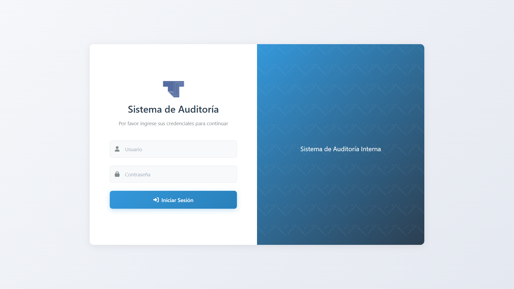
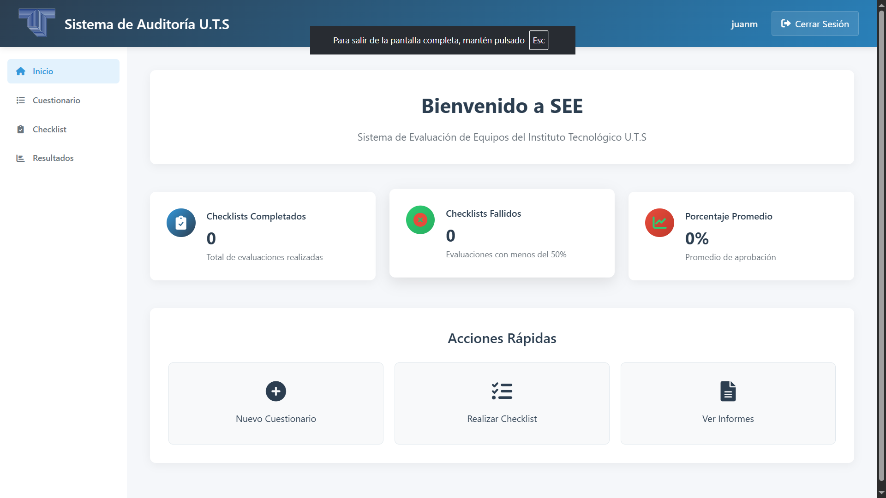

# Team Evaluation System (TES)


A comprehensive audit management system built with Django that enables compliance evaluations, report generation, and performance metric tracking.

## 🚀 Key Features

- **User Authentication**: Secure login system
- **Dynamic Questionnaires**: Questions organized by departments/areas
- **Automatic Percentage Calculation**: Real-time compliance percentage display
- **Dashboard**: Key metrics visualization
- **Report Generation**: Export audit results
- **Responsive Interface**: Adaptive design for different devices

## 📸 Screenshots

| Login Page | Dashboard | Evaluation Form |
|------------|-----------|-----------------|
|  |  |  |

## 🛠️ Prerequisites

- Python 3.8+
- Django 4.0+
- pip (Python package manager)
- Django-compatible database (SQLite by default)

## 🚀 Installation

1. **Clone the repository**
   ```bash
   git clone https://github.com/JuanMoran12/django_app.git
   cd django_app
   ```

2. **Create and activate a virtual environment**
   ```bash
   python -m venv venv
   # On Windows:
   .\venv\Scripts\activate
   # On macOS/Linux:
   # source venv/bin/activate
   ```

3. **Install dependencies**
   ```bash
   pip install -r requirements.txt
   ```

4. **Set up the database**
   ```bash
   python manage.py makemigrations
   python manage.py migrate
   ```

5. **Create a superuser (optional)**
   ```bash
   python manage.py createsuperuser
   ```

6. **Start the development server**
   ```bash
   python manage.py runserver
   ```

7. **Access the application**
   Open your browser and navigate to `http://127.0.0.1:8000/`
   Use the admin interface at: `http://127.0.0.1:8000/admin/`

## 🔧 Environment Variables

Create a `.env` file in the project root with the following variables:

```env
# Django Settings
DJANGO_SECRET_KEY=your-secret-key-here
DJANGO_DEBUG=True
DJANGO_ALLOWED_HOSTS=localhost,127.0.0.1

# Database
DJANGO_DB_PATH=db.sqlite3
```

## 🏗️ Project Structure

```
django_app/
├── auditoria/           # Project configuration
├── cuestionario/        # Main application
│   ├── migrations/     # Database migrations
│   ├── static/         # Static files (CSS, JS, images)
│   ├── templates/      # HTML templates
│   ├── admin.py        # Admin configuration
│   ├── apps.py         # App configuration
│   ├── models.py       # Database models
│   ├── urls.py         # URL routing
│   └── views.py        # View functions
├── docs/               # Documentation and screenshots
├── manage.py           # Command-line utility
└── requirements.txt    # Project dependencies
```

## 📊 Key Metrics

- Total number of audits performed
- Average compliance percentage
- Number of passed/failed audits
- Performance metrics over time

## 🔒 Security Features

- Secure user authentication
- CSRF protection
- Secure password handling
- Protected route access control
- Session security

## 🤝 Contributing

1. Fork the Project
2. Create your Feature Branch (`git checkout -b feature/AmazingFeature`)
3. Commit your Changes (`git commit -m 'Add some AmazingFeature'`)
4. Push to the Branch (`git push origin feature/AmazingFeature`)
5. Open a Pull Request

## 📄 License

This project is licensed under the MIT License - see the [LICENSE](LICENSE) file for details.

## ✨ Acknowledgments

- [Django](https://www.djangoproject.com/)
- [Font Awesome](https://fontawesome.com/)

## 📞 Contact

For any inquiries, please open an issue on the [GitHub repository](https://github.com/JuanMoran12/django_app).
